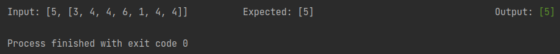
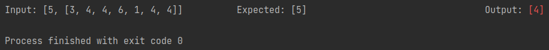

# Coding interview template
This is a Java template for live coding sessions, so we don't have to write
unnecessary boilerplate code and focus only on writing the solution to the
problem at hand.

This is intended for interviews where sharing the screen and coding in our local machine using our
preferred IDE is allowed.

## How to use it
We just need to update some parts of the `Main` class:
* First we need to define the output type for our problem. In the example
  from the template it's `Integer`, but let's assume our problem needs the
  solution to return an array of integers, so it needs to be defined as `int[]`:
  ```java
  public class Main extends Output<int[]> {
    public static void main(String[] args) {
      Object[][] tests = {
          {5, new int[] {3, 4, 4, 6, 1, 4, 4}, /* Expected output: */ new int[] {5}}
      };
      new Main().process(tests, int[].class);
    }
  
    @Override
    protected int[] solution(Object[] inputs) {
      int N = (int) inputs[0];
      int[] A = (int[]) inputs[1];
  
      // Implement
  
      return new int[] {5};
    }
  }
  ```
* Next we need to define all the tests we think are good enough to test the
  solution, and update the `tests` variable accordingly. As an example it already
  defines one test:
  ```java
  {5, new int[] {3, 4, 4, 6, 1, 4, 4}, /* Expected output: */ new int[] {5}}
  ```
  Notice that the last element of the array is the expected output value,
  where all the other elements are the list of parameter values that our solution
  expects.
* After that we just need to update the parameters variables, so we can access them
  more easily. This is illustrated in the example code already:
  ```java
  int N = (int) inputs[0];
  int[] A = (int[]) inputs[1];
  ```
  We can see that our example solution expects two parameters (`int N, int[] A`).
* Finally, we need to implement our awesome solution and return the actual result.

Everytime we run the `main` method, the console will display a result from executing
all the test cases we defined previously. Running the example we would get this output:



All passing tests will show the output value as green, and all failing tests will
show this value as red, like this:



And that's it, good luck!